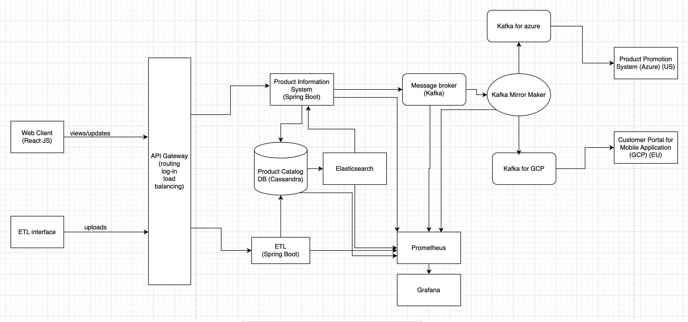

# Real Time Product Information System ADRs.

Captures Architecture Decision Records.

### Architecture Envisioned:

### Applications Overview:

1. Data Loader/ETL: 

2. Product Information System: 

3. Frontend - 

4. Infrastructure brief overview - 

### ADRs

